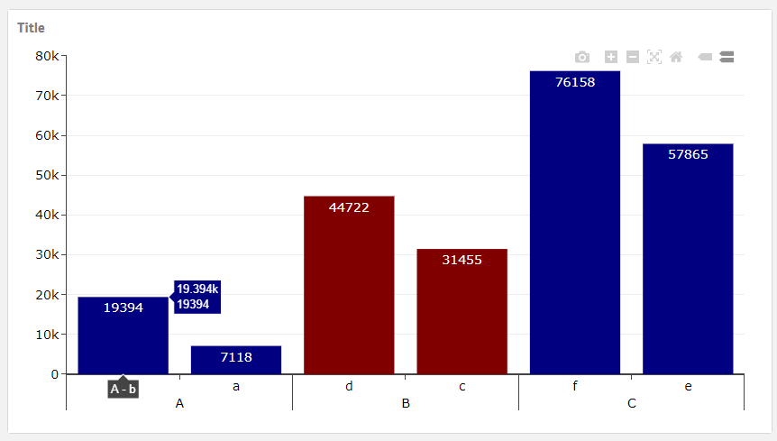
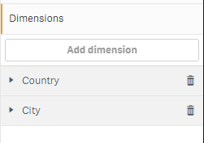
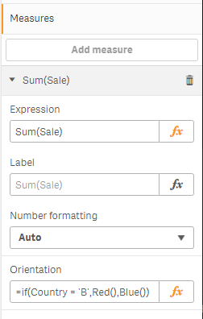
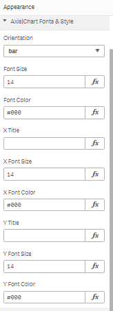
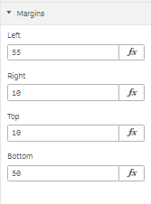

# Ploty Bar Line Chart
Multiple Axes | Bar or Line | Styling option

<h1>Chart</h1>

<h1>Dimension up to 2</h1>

<h1>Measure 1</h1>

<h1>Chart Setting Style</h1>

<h1>Chart Setting Margin</h1>

